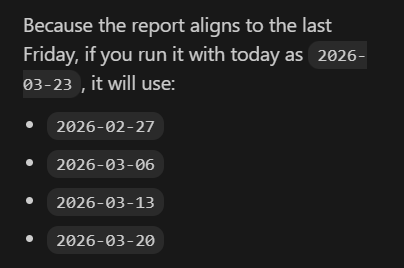

# FX Macro Bias Engine (4 Pillars + Market Overlay)

`fxbias` is a deterministic FX macro scoring engine with a report dashboard.  
The 4 fundamentals pillars remain unchanged:

1. Rates differential
2. Growth differential
3. Risk regime
4. Positioning (COT)

Options skew is an optional **Market Overlay** and does not change fundamentals scores.

## Quick start

Windows PowerShell:

```powershell
# Recommended: standard CPython, not MSYS2/Git Bash Python
py -3.11 -m venv .venv
.venv\Scripts\Activate.ps1
python -m pip install --upgrade pip
pip install -r requirements.txt
```

macOS/Linux:

```bash
python3 -m venv .venv
source .venv/bin/activate
python -m pip install --upgrade pip
pip install -r requirements.txt

# default run
python -m fxbias run

# JSON run output
python -m fxbias run --format json --out out/bias.json
```

If Windows `pip install -r requirements.txt` starts compiling `numpy` or `pandas`
from source and mentions `C:\msys64\...` or missing `Python.h`, the venv was
created from MSYS2/Git Bash Python. Recreate it with `py -3.11 -m venv .venv`
so `numpy`, `pandas`, and `pyarrow` install from prebuilt Windows wheels.

## Report commands

```bash
# Backward-compatible weekly report
python -m fxbias report --weeks 4 --format html

# Single-date report
python -m fxbias report --asof 2026-02-20 --format html

# Compare two report dates
python -m fxbias report --compare 2026-02-13,2026-02-20 --format html

# Report with market overlay from Investing options page
python -m fxbias report --asof 2026-02-20 --with-options --options-url <investing-url> --format html
```

## Options snapshot command

```bash
python -m fxbias options-snapshot \
  --symbol XAUUSD \
  --tenor 1M \
  --url <investing-url> \
  --out out
```

Writes:
- `*_options_summary_*.json`
- `*_options_surface_*.parquet`
- `*_options_snapshot_*.html`

## Dashboard tabs

The report HTML contains:
- `Overview`: bias/score/conviction heatmaps, leaderboard, market overlay summary
- `Pair Drilldown`: pair + week selectors, pillar scores, raw values, provenance, staleness, overlay details
- `Compare`: delta per pair and pillar, regime flips, persistence streaks
- `Data Quality`: stale rates/counts, provider freshness, risk-regime timestamps
- `Methods`: scoring/weights, renormalization, conviction tiers, staleness logic, overlay semantics

## Output artifacts

`fxbias report` returns generated paths for:
- `html` (when requested)
- `pdf` (when requested)
- `panel.csv`
- `panel.json`
- `options.json` (when `--with-options` is enabled)

Example existing samples are under `out/`:
- `out/weekly_dashboard_*.html`
- `out/weekly_dashboard_*.pdf`

## Determinism and integrity

- Rows and payloads are sorted deterministically by `as_of` and `pair`.
- Stable JSON ordering is used for machine outputs.
- Pillar provenance (`obs_date`, `age_days`) and staleness flags are included.
- Tests do not require live web access (options parser uses offline fixture HTML).

## Data sources

- Market prices/yields: Stooq
- Risk components: Stooq + FRED
- Positioning: CFTC Socrata
- Optional hard growth mode: TradingEconomics API
- Optional market overlay: Investing options table (Playwright-rendered HTML)

## Notes

- Installing Playwright browser binaries is required for live options fetch:
  `playwright install chromium`
- Educational/research use only, not investment advice.


//RUN:

python -m fxbias report --weeks 2 --format html --outdir out

python -m fxbias report --with-options --options-url "https://www.investing.com/currencies/xau-usd-options"


# safest: bypass activation entirely
.\.venv\Scripts\python.exe -m fxbias report --weeks 2 --format html --outdir out

.\.venv\Scripts\python.exe -m fxbias report --with-options --options-url "https://www.investing.com/currencies/xau-usd-options"

//REPORT HTML
.\.venv\Scripts\python.exe -m fxbias report --asof 2026-01-02 --with-sentiment --format both --outdir out --refresh



//Monthly
.\.venv\Scripts\python.exe -m fxbias report --months 3 --with-sentiment --format both --outdir out --refresh


